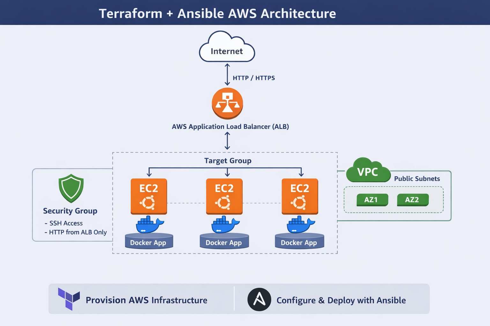
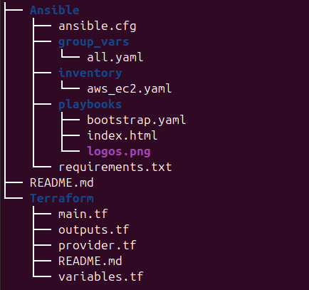

#  Terraform + Ansible AWS Infrastructure Project

##  Overview

This project demonstrates a complete **DevOps workflow** using Infrastructure as Code and Configuration Management:

- **Terraform** provisions AWS infrastructure
- **Ansible** dynamically discovers and configures EC2 instances
- **Docker** deploys an application across multiple servers
- **AWS Application Load Balancer (ALB)** distributes traffic

The result is a **highly available, load-balanced web service** running across multiple EC2 instances.

---

##  Architecture



Internet
│
▼
AWS Application Load Balancer (ALB)
│
▼
Target Group (EC2 Instances)
│
▼
Docker Containers (Web App)


### Key Design Decisions

- EC2 instances are placed in **public subnets**
- ALB handles all inbound HTTP traffic
- Instance security group allows traffic **only from ALB**
- Ansible uses **dynamic inventory via AWS plugin**
- Docker is used for consistent application deployment

---

##  Technologies Used

- **Terraform**
- **Ansible**
- **AWS (EC2, VPC, ALB, Security Groups)**
- **Docker**
- **Ubuntu 24.04**
- **Python (Ansible runtime)**

---

##  Project Structure



##  Deployment Instructions

### 1. Clone the Repository

```bash
git clone https://github.com/your-username/your-repo.git
cd your-repo

2. Initialize and Apply Terraform

cd Terraform
terraform init
terraform apply

After completion, note the output:

terraform output alb_dns_name

3. Set Up Ansible Environment

cd ../Ansible

python3 -m venv .venv
source .venv/bin/activate

pip install ansible boto3 botocore
ansible-galaxy collection install amazon.aws

4. Run Ansible Playbook

ansible-playbook -i inventory/aws_ec2.yml playbooks/bootstrap.yml

This will:

Install Docker
Configure EC2 instances
Deploy the web application

5. Access the Application

Open in browser:

http://<alb_dns_name>

 Security Design
ALB allows inbound traffic from the internet (port 80/443)
EC2 instances:
Allow SSH (port 22) for admin access
Allow HTTP (port 80) only from ALB security group
No direct public HTTP access to EC2 instances

 Automation Workflow
Terraform provisions infrastructure
Ansible dynamically discovers EC2 instances via AWS
Ansible configures instances and deploys application
ALB routes traffic across all instances

 Future Improvements
Add HTTPS using AWS ACM
Move EC2 instances to private subnets
Use AWS Systems Manager (SSM) instead of SSH
Implement CI/CD pipeline (GitHub Actions)
Deploy a custom Docker application (Flask/Node.js)
Add monitoring (Prometheus/Grafana)

 Key Learnings
Separation of concerns:
Terraform = infrastructure
Ansible = configuration
Dynamic inventory simplifies scaling
Proper AWS security group design is critical
Load balancing improves availability and resilience

‍💻 Author

Marco Gonzalez
DevOps / Systems Administrator

 License

This project is for educational and portfolio purposes.


